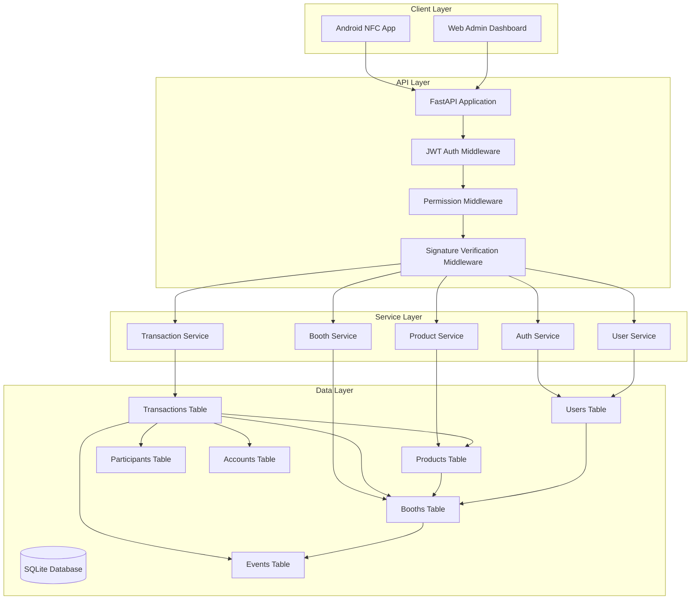
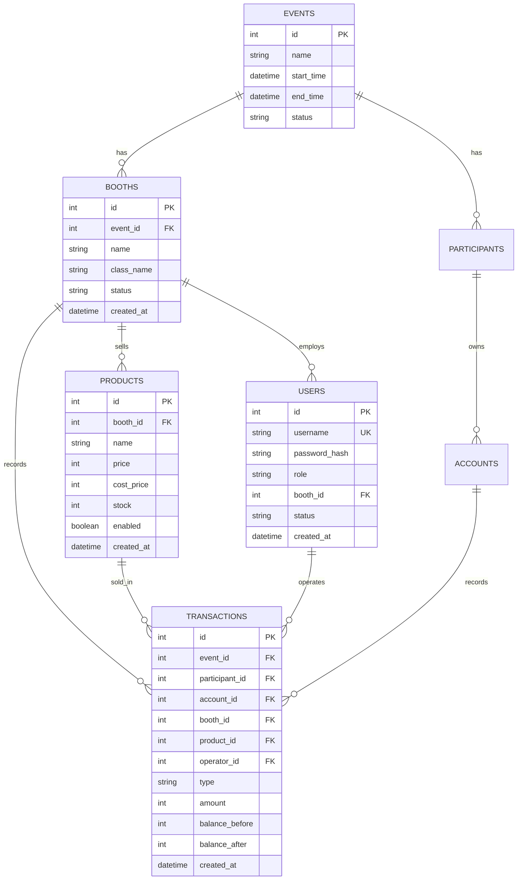
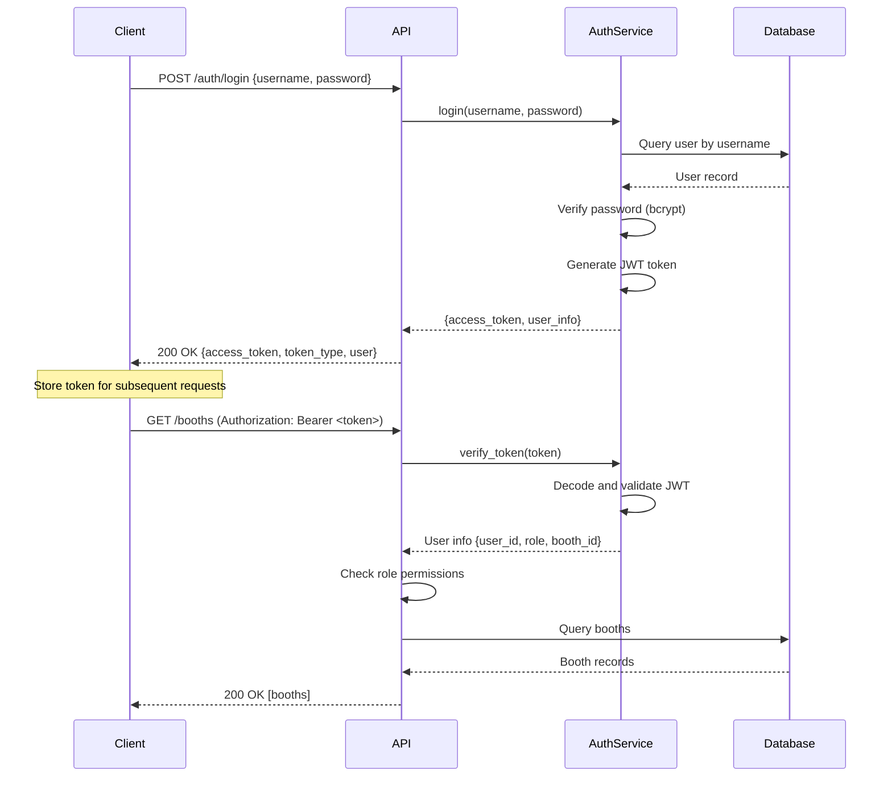
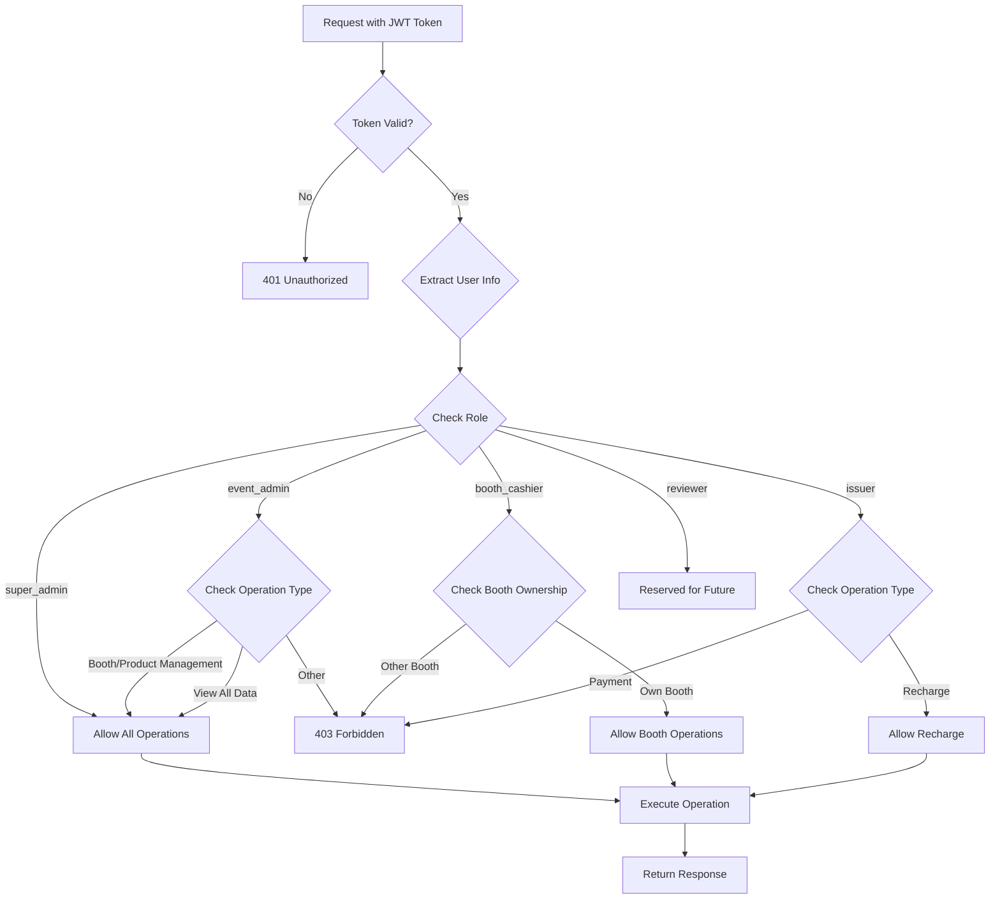

# Design Document: Booth Management System

## Overview

本设计文档描述了"摊位经营系统"（Booth Management System）的技术架构和实现方案。该系统将现有的 NFC 校园钱包项目从"活动额度系统"升级为支持多摊位经营的完整商业管理系统。

### 设计目标

1. **多摊位管理**: 支持活动中多个摊位的独立经营和数据隔离
2. **商品管理**: 为每个摊位提供商品信息管理和库存追踪
3. **用户角色系统**: 实现基于角色的访问控制（RBAC）
4. **JWT 认证**: 提供安全的用户认证和授权机制
5. **交易追踪**: 增强交易记录，关联摊位和商品信息
6. **向后兼容**: 保持与现有 API 和客户端的兼容性

### 核心特性

- **摊位（Booths）**: 代表活动中的经营单位，由班级或团队运营
- **商品（Products）**: 摊位销售的物品或服务，支持价格、成本和库存管理
- **用户角色（User Roles）**: 
  - Super_Admin: 超级管理员
  - Event_Admin: 活动管理员
  - Booth_Cashier: 摊位收银员
  - Issuer: 发放员
  - Reviewer: 审核员（预留）
- **权限控制**: 基于角色和摊位所有权的细粒度权限控制
- **JWT 认证**: 无状态的令牌认证机制

## Architecture

### 系统架构图



### 技术栈

- **Backend Framework**: FastAPI (Python 3.8+)
- **ORM**: SQLAlchemy
- **Database**: SQLite (可升级到 PostgreSQL/MySQL)
- **Authentication**: JWT (PyJWT)
- **Password Hashing**: bcrypt
- **API Documentation**: OpenAPI/Swagger

### 架构层次

1. **API Layer**: 
   - FastAPI 路由处理
   - 请求验证和响应格式化
   - 中间件链（JWT 认证 → 权限验证 → 签名验证）

2. **Service Layer**:
   - 业务逻辑封装
   - 事务管理
   - 跨模型操作协调

3. **Data Layer**:
   - ORM 模型定义
   - 数据库约束和索引
   - 关系映射

## Components and Interfaces

### 1. 数据模型（ORM Models）

#### 1.1 User Model

```python
class User(Base):
    """
    用户模型 - 系统用户账户
    
    Attributes:
        id: 主键，自增
        username: 用户名，唯一
        password_hash: bcrypt 哈希密码
        role: 用户角色 (super_admin, event_admin, booth_cashier, issuer, reviewer)
        booth_id: 关联摊位ID（仅 booth_cashier 需要）
        status: 用户状态 (active, inactive, blocked)
        created_at: 创建时间
        updated_at: 更新时间
    """
    __tablename__ = 'users'
    
    id = Column(Integer, primary_key=True, autoincrement=True)
    username = Column(String(50), unique=True, nullable=False, index=True)
    password_hash = Column(String(255), nullable=False)
    role = Column(String(20), nullable=False, index=True)
    booth_id = Column(Integer, ForeignKey('booths.id'), nullable=True, index=True)
    status = Column(String(20), nullable=False, default='active')
    created_at = Column(DateTime, nullable=False, default=datetime.utcnow)
    updated_at = Column(DateTime, nullable=False, default=datetime.utcnow, onupdate=datetime.utcnow)
    
    # Relationships
    booth = relationship("Booth", back_populates="cashiers")
    
    # Constraints
    __table_args__ = (
        CheckConstraint(
            "role IN ('super_admin', 'event_admin', 'booth_cashier', 'issuer', 'reviewer')",
            name='chk_user_role'
        ),
        CheckConstraint(
            "status IN ('active', 'inactive', 'blocked')",
            name='chk_user_status'
        ),
        CheckConstraint(
            "(role = 'booth_cashier' AND booth_id IS NOT NULL) OR (role != 'booth_cashier')",
            name='chk_booth_cashier_has_booth'
        ),
    )
```

#### 1.2 Booth Model

```python
class Booth(Base):
    """
    摊位模型 - 活动中的经营单位
    
    Attributes:
        id: 主键，自增
        event_id: 关联活动ID
        name: 摊位名称
        class_name: 班级名称
        status: 摊位状态 (active, inactive, closed)
        created_at: 创建时间
    """
    __tablename__ = 'booths'
    
    id = Column(Integer, primary_key=True, autoincrement=True)
    event_id = Column(Integer, ForeignKey('events.id'), nullable=False, index=True)
    name = Column(String(100), nullable=False)
    class_name = Column(String(100), nullable=False)
    status = Column(String(20), nullable=False, default='active')
    created_at = Column(DateTime, nullable=False, default=datetime.utcnow)
    
    # Relationships
    event = relationship("Event", back_populates="booths")
    products = relationship("Product", back_populates="booth", cascade="all, delete-orphan")
    cashiers = relationship("User", back_populates="booth")
    transactions = relationship("Transaction", back_populates="booth")
    
    # Constraints
    __table_args__ = (
        CheckConstraint(
            "status IN ('active', 'inactive', 'closed')",
            name='chk_booth_status'
        ),
    )
```

#### 1.3 Product Model

```python
class Product(Base):
    """
    商品模型 - 摊位销售的商品
    
    Attributes:
        id: 主键，自增
        booth_id: 关联摊位ID
        name: 商品名称
        price: 售价（分）
        cost_price: 成本价（分）
        stock: 库存数量（null 表示无限）
        enabled: 是否启用
        created_at: 创建时间
    """
    __tablename__ = 'products'
    
    id = Column(Integer, primary_key=True, autoincrement=True)
    booth_id = Column(Integer, ForeignKey('booths.id'), nullable=False, index=True)
    name = Column(String(100), nullable=False)
    price = Column(Integer, nullable=False)
    cost_price = Column(Integer, nullable=True)
    stock = Column(Integer, nullable=True)
    enabled = Column(Boolean, nullable=False, default=True)
    created_at = Column(DateTime, nullable=False, default=datetime.utcnow)
    
    # Relationships
    booth = relationship("Booth", back_populates="products")
    transactions = relationship("Transaction", back_populates="product")
    
    # Constraints
    __table_args__ = (
        CheckConstraint('price >= 0', name='chk_price_non_negative'),
        CheckConstraint('cost_price IS NULL OR cost_price >= 0', name='chk_cost_price_non_negative'),
        CheckConstraint('stock IS NULL OR stock >= 0', name='chk_stock_non_negative'),
    )
```

#### 1.4 Transaction Model (Enhanced)

```python
class Transaction(Base):
    """
    交易模型（增强版）- 添加摊位和商品关联
    
    New Attributes:
        booth_id: 关联摊位ID（可选，向后兼容）
        product_id: 关联商品ID（可选）
        operator_id: 操作员用户ID（可选）
    """
    __tablename__ = 'transactions'
    
    # ... existing fields ...
    
    # New fields for booth management
    booth_id = Column(Integer, ForeignKey('booths.id'), nullable=True, index=True)
    product_id = Column(Integer, ForeignKey('products.id'), nullable=True, index=True)
    operator_id = Column(Integer, ForeignKey('users.id'), nullable=True, index=True)
    
    # New relationships
    booth = relationship("Booth", back_populates="transactions")
    product = relationship("Product", back_populates="transactions")
    operator = relationship("User", foreign_keys=[operator_id])
```

### 2. 服务层（Service Layer）

#### 2.1 AuthService

```python
class AuthService:
    """
    认证服务 - 处理用户登录和 JWT 令牌管理
    """
    
    def login(self, username: str, password: str) -> dict:
        """
        用户登录
        
        Returns:
            {
                "access_token": "jwt_token_string",
                "token_type": "bearer",
                "user": {
                    "id": 1,
                    "username": "admin",
                    "role": "super_admin",
                    "booth_id": null
                }
            }
        """
        
    def verify_token(self, token: str) -> dict:
        """
        验证 JWT 令牌
        
        Returns:
            {
                "user_id": 1,
                "username": "admin",
                "role": "super_admin",
                "booth_id": null
            }
        """
        
    def create_access_token(self, user: User) -> str:
        """创建 JWT 访问令牌"""
        
    def hash_password(self, password: str) -> str:
        """使用 bcrypt 哈希密码"""
        
    def verify_password(self, plain_password: str, hashed_password: str) -> bool:
        """验证密码"""
```

#### 2.2 BoothService

```python
class BoothService:
    """
    摊位服务 - 处理摊位管理操作
    """
    
    def create_booth(self, event_id: int, name: str, class_name: str) -> Booth:
        """创建摊位"""
        
    def get_booth(self, booth_id: int) -> Booth:
        """获取摊位详情"""
        
    def list_booths(self, event_id: Optional[int] = None) -> List[Booth]:
        """列出摊位"""
        
    def update_booth_status(self, booth_id: int, status: str) -> Booth:
        """更新摊位状态"""
        
    def validate_booth_ownership(self, user: User, booth_id: int) -> bool:
        """验证用户是否拥有摊位权限"""
```

#### 2.3 ProductService

```python
class ProductService:
    """
    商品服务 - 处理商品管理操作
    """
    
    def create_product(
        self,
        booth_id: int,
        name: str,
        price: int,
        cost_price: Optional[int] = None,
        stock: Optional[int] = None
    ) -> Product:
        """创建商品"""
        
    def get_product(self, product_id: int) -> Product:
        """获取商品详情"""
        
    def list_products(self, booth_id: Optional[int] = None) -> List[Product]:
        """列出商品"""
        
    def update_product(self, product_id: int, **kwargs) -> Product:
        """更新商品信息"""
        
    def validate_product_belongs_to_booth(self, product_id: int, booth_id: int) -> bool:
        """验证商品属于指定摊位"""
```

#### 2.4 Enhanced TransactionService

```python
class TransactionService:
    """
    交易服务（增强版）- 支持摊位和商品关联
    """
    
    def process_booth_payment(
        self,
        event_id: int,
        card_uid: str,
        booth_id: int,
        amount_yuan: float,
        operator_id: int,
        product_id: Optional[int] = None,
        remark: Optional[str] = None
    ) -> TransactionResult:
        """
        处理摊位支付交易
        
        验证流程:
        1. 验证活动允许消费
        2. 验证摊位属于活动
        3. 验证操作员有权限操作该摊位
        4. 如果提供 product_id，验证商品属于该摊位
        5. 执行支付交易
        """
        
    def get_booth_transactions(
        self,
        booth_id: int,
        start_date: Optional[str] = None,
        end_date: Optional[str] = None
    ) -> List[Transaction]:
        """获取摊位交易记录"""
```

### 3. API 端点（API Endpoints）

#### 3.1 认证端点

```
POST /auth/login
- 用户登录
- Request: {"username": "admin", "password": "password123"}
- Response: {"access_token": "jwt_token", "token_type": "bearer", "user": {...}}

GET /auth/me
- 获取当前用户信息
- Headers: Authorization: Bearer <token>
- Response: {"id": 1, "username": "admin", "role": "super_admin", ...}
```

#### 3.2 摊位管理端点

```
POST /booths
- 创建摊位
- Roles: event_admin, super_admin
- Request: {"event_id": 1, "name": "美食摊", "class_name": "高一(1)班"}
- Response: {"id": 1, "event_id": 1, "name": "美食摊", ...}

GET /booths
- 列出摊位
- Roles: event_admin, super_admin
- Query: ?event_id=1
- Response: [{"id": 1, "name": "美食摊", ...}, ...]

GET /booths/{id}
- 获取摊位详情
- Roles: event_admin, super_admin, booth_cashier (own booth)
- Response: {"id": 1, "name": "美食摊", ...}
```

#### 3.3 商品管理端点

```
POST /products
- 创建商品
- Roles: event_admin, super_admin
- Request: {"booth_id": 1, "name": "奶茶", "price": 500, "cost_price": 300, "stock": 100}
- Response: {"id": 1, "booth_id": 1, "name": "奶茶", ...}

GET /products
- 列出商品
- Roles: event_admin, super_admin, booth_cashier (own booth products)
- Query: ?booth_id=1
- Response: [{"id": 1, "name": "奶茶", ...}, ...]

PATCH /products/{id}
- 更新商品
- Roles: event_admin, super_admin
- Request: {"price": 600, "stock": 80}
- Response: {"id": 1, "price": 600, "stock": 80, ...}
```

#### 3.4 增强的支付端点

```
POST /pay
- 处理支付（增强版，支持摊位和商品）
- Roles: booth_cashier (own booth), issuer (no), event_admin, super_admin
- Request: {
    "event_id": 1,
    "card_uid": "A1B2C3D4",
    "booth_id": 1,
    "product_id": 1,  // optional
    "amount": 5.00,
    "timestamp": 1234567890,
    "signature": "..."
  }
- Response: {"success": true, "new_balance": 45.00, "transaction_id": 123}
```

### 4. 中间件（Middleware）

#### 4.1 JWT Authentication Dependency

```python
async def get_current_user(
    token: str = Depends(oauth2_scheme),
    db: Session = Depends(get_db)
) -> User:
    """
    JWT 认证依赖
    
    从 Authorization header 提取 JWT 令牌，验证并返回当前用户
    
    Raises:
        HTTPException(401): 令牌无效或过期
    """
```

#### 4.2 Role-Based Authorization Dependency

```python
class RoleChecker:
    """
    角色检查器 - 验证用户角色
    """
    def __init__(self, allowed_roles: List[str]):
        self.allowed_roles = allowed_roles
    
    def __call__(self, current_user: User = Depends(get_current_user)):
        """
        验证用户角色
        
        Raises:
            HTTPException(403): 用户角色不在允许列表中
        """
```

#### 4.3 Booth Ownership Validation Dependency

```python
async def validate_booth_ownership(
    booth_id: int,
    current_user: User = Depends(get_current_user),
    db: Session = Depends(get_db)
):
    """
    摊位所有权验证依赖
    
    验证 booth_cashier 只能访问自己的摊位
    event_admin 和 super_admin 可以访问所有摊位
    
    Raises:
        HTTPException(403): 用户无权访问该摊位
    """
```

## Data Models

### 数据库 Schema

#### Users Table

```sql
CREATE TABLE users (
    id INTEGER PRIMARY KEY AUTOINCREMENT,
    username VARCHAR(50) UNIQUE NOT NULL,
    password_hash VARCHAR(255) NOT NULL,
    role VARCHAR(20) NOT NULL,
    booth_id INTEGER,
    status VARCHAR(20) NOT NULL DEFAULT 'active',
    created_at DATETIME NOT NULL DEFAULT CURRENT_TIMESTAMP,
    updated_at DATETIME NOT NULL DEFAULT CURRENT_TIMESTAMP,
    FOREIGN KEY (booth_id) REFERENCES booths(id) ON DELETE SET NULL,
    CHECK (role IN ('super_admin', 'event_admin', 'booth_cashier', 'issuer', 'reviewer')),
    CHECK (status IN ('active', 'inactive', 'blocked')),
    CHECK ((role = 'booth_cashier' AND booth_id IS NOT NULL) OR (role != 'booth_cashier'))
);

CREATE INDEX idx_users_username ON users(username);
CREATE INDEX idx_users_role ON users(role);
CREATE INDEX idx_users_booth_id ON users(booth_id);
```

#### Booths Table

```sql
CREATE TABLE booths (
    id INTEGER PRIMARY KEY AUTOINCREMENT,
    event_id INTEGER NOT NULL,
    name VARCHAR(100) NOT NULL,
    class_name VARCHAR(100) NOT NULL,
    status VARCHAR(20) NOT NULL DEFAULT 'active',
    created_at DATETIME NOT NULL DEFAULT CURRENT_TIMESTAMP,
    FOREIGN KEY (event_id) REFERENCES events(id) ON DELETE CASCADE,
    CHECK (status IN ('active', 'inactive', 'closed'))
);

CREATE INDEX idx_booths_event_id ON booths(event_id);
```

#### Products Table

```sql
CREATE TABLE products (
    id INTEGER PRIMARY KEY AUTOINCREMENT,
    booth_id INTEGER NOT NULL,
    name VARCHAR(100) NOT NULL,
    price INTEGER NOT NULL,
    cost_price INTEGER,
    stock INTEGER,
    enabled BOOLEAN NOT NULL DEFAULT 1,
    created_at DATETIME NOT NULL DEFAULT CURRENT_TIMESTAMP,
    FOREIGN KEY (booth_id) REFERENCES booths(id) ON DELETE CASCADE,
    CHECK (price >= 0),
    CHECK (cost_price IS NULL OR cost_price >= 0),
    CHECK (stock IS NULL OR stock >= 0)
);

CREATE INDEX idx_products_booth_id ON products(booth_id);
```

#### Transactions Table (Enhanced)

```sql
-- Add new columns to existing transactions table
ALTER TABLE transactions ADD COLUMN booth_id INTEGER;
ALTER TABLE transactions ADD COLUMN product_id INTEGER;
ALTER TABLE transactions ADD COLUMN operator_id INTEGER;

-- Add foreign key constraints (if supported by SQLite version)
-- Otherwise, enforce in application layer
CREATE INDEX idx_transactions_booth_id ON transactions(booth_id);
CREATE INDEX idx_transactions_product_id ON transactions(product_id);
CREATE INDEX idx_transactions_operator_id ON transactions(operator_id);
```

### 实体关系图（ERD）



### 数据关系说明

1. **Event → Booth**: 一对多，一个活动可以有多个摊位
2. **Booth → Product**: 一对多，一个摊位可以销售多个商品
3. **Booth → User**: 一对多，一个摊位可以有多个收银员
4. **Booth → Transaction**: 一对多，一个摊位有多条交易记录
5. **Product → Transaction**: 一对多，一个商品可以在多条交易中出现
6. **User → Transaction**: 一对多，一个操作员可以处理多条交易

## Authentication and Authorization Flow

### JWT Authentication Flow



### Permission Validation Flow



### Role-Based Access Control Matrix

| Operation | super_admin | event_admin | booth_cashier | issuer | reviewer |
|-----------|-------------|-------------|---------------|--------|----------|
| Create Booth | ✓ | ✓ | ✗ | ✗ | ✗ |
| View All Booths | ✓ | ✓ | ✗ | ✗ | ✗ |
| View Own Booth | ✓ | ✓ | ✓ | ✗ | ✗ |
| Create Product | ✓ | ✓ | ✗ | ✗ | ✗ |
| Update Product | ✓ | ✓ | ✗ | ✗ | ✗ |
| View All Products | ✓ | ✓ | ✗ | ✗ | ✗ |
| View Own Booth Products | ✓ | ✓ | ✓ | ✗ | ✗ |
| Process Payment (Own Booth) | ✓ | ✓ | ✓ | ✗ | ✗ |
| Process Payment (Any Booth) | ✓ | ✓ | ✗ | ✗ | ✗ |
| Process Recharge | ✓ | ✓ | ✗ | ✓ | ✗ |
| View All Transactions | ✓ | ✓ | ✗ | ✗ | ✗ |
| View Own Booth Transactions | ✓ | ✓ | ✓ | ✗ | ✗ |
| Create User | ✓ | ✗ | ✗ | ✗ | ✗ |
| Manage Users | ✓ | ✗ | ✗ | ✗ | ✗ |

## Error Handling

### Error Response Format

所有错误响应遵循统一格式：

```json
{
    "error_code": "ERROR_CODE",
    "message": "Human-readable error message",
    "field": "field_name",  // optional, for validation errors
    "value": "invalid_value"  // optional, for validation errors
}
```

### Error Codes

#### Authentication Errors (401)

- `AUTH_ERROR`: 通用认证错误
- `INVALID_CREDENTIALS`: 用户名或密码错误
- `TOKEN_EXPIRED`: JWT 令牌已过期
- `TOKEN_INVALID`: JWT 令牌无效
- `TOKEN_MISSING`: 缺少 JWT 令牌

#### Authorization Errors (403)

- `PERMISSION_DENIED`: 权限不足
- `BOOTH_ACCESS_DENIED`: 无权访问该摊位
- `ROLE_NOT_ALLOWED`: 角色不允许执行该操作

#### Validation Errors (400)

- `VALIDATION_ERROR`: 通用验证错误
- `INVALID_BOOTH_ID`: 无效的摊位ID
- `INVALID_PRODUCT_ID`: 无效的商品ID
- `INVALID_EVENT_ID`: 无效的活动ID
- `PRODUCT_NOT_IN_BOOTH`: 商品不属于指定摊位
- `BOOTH_NOT_IN_EVENT`: 摊位不属于指定活动
- `INSUFFICIENT_STOCK`: 库存不足
- `NEGATIVE_PRICE`: 价格不能为负数
- `NEGATIVE_STOCK`: 库存不能为负数

#### Resource Not Found Errors (404)

- `BOOTH_NOT_FOUND`: 摊位不存在
- `PRODUCT_NOT_FOUND`: 商品不存在
- `USER_NOT_FOUND`: 用户不存在
- `EVENT_NOT_FOUND`: 活动不存在

#### Business Logic Errors (400)

- `INSUFFICIENT_FUNDS`: 余额不足
- `EVENT_INACTIVE`: 活动未激活
- `BOOTH_INACTIVE`: 摊位未激活
- `PRODUCT_DISABLED`: 商品已禁用
- `USER_BLOCKED`: 用户已被封禁

### Error Handling Strategy

1. **Input Validation**: 在服务层入口进行参数验证，使用 Pydantic schemas
2. **Business Rule Validation**: 在服务层执行业务规则验证
3. **Database Constraints**: 依赖数据库约束作为最后防线
4. **Exception Hierarchy**: 使用自定义异常类层次结构
5. **Logging**: 所有错误都记录到日志，包含上下文信息
6. **User-Friendly Messages**: 返回给客户端的错误消息清晰易懂

### Exception Hierarchy

```python
class BoothManagementException(Exception):
    """Base exception for booth management system"""
    def __init__(self, message: str, error_code: str):
        self.message = message
        self.error_code = error_code
        super().__init__(self.message)

class AuthenticationError(BoothManagementException):
    """Authentication related errors"""
    pass

class AuthorizationError(BoothManagementException):
    """Authorization related errors"""
    pass

class ValidationError(BoothManagementException):
    """Validation related errors"""
    pass

class ResourceNotFoundError(BoothManagementException):
    """Resource not found errors"""
    pass

class BusinessLogicError(BoothManagementException):
    """Business logic errors"""
    pass
```

## Testing Strategy

### 测试方法论

由于摊位经营系统主要涉及以下特性，**不适合使用属性测试（Property-Based Testing）**：

1. **CRUD 操作**: 数据库的创建、读取、更新、删除操作
2. **权限验证**: 基于角色和所有权的访问控制
3. **JWT 认证**: 令牌生成和验证（确定性操作）
4. **数据关联验证**: 外键约束和业务规则验证
5. **状态管理**: 摊位、商品、用户状态转换

这些特性更适合使用**示例测试（Example-Based Tests）**和**集成测试（Integration Tests）**。

### 测试策略

#### 1. 单元测试（Unit Tests）

使用 pytest 进行单元测试，覆盖以下内容：

**Service Layer Tests**:
- `AuthService`: 
  - 测试密码哈希和验证
  - 测试 JWT 令牌生成和验证
  - 测试登录成功和失败场景
  
- `BoothService`:
  - 测试摊位创建、查询、更新
  - 测试摊位所有权验证
  - 测试摊位状态转换
  
- `ProductService`:
  - 测试商品创建、查询、更新
  - 测试商品与摊位关联验证
  - 测试库存管理
  
- `TransactionService`:
  - 测试摊位支付流程
  - 测试权限验证
  - 测试交易记录创建

**Middleware Tests**:
- JWT 认证中间件测试
- 角色权限检查测试
- 摊位所有权验证测试

**Model Tests**:
- 数据库约束验证
- 关系映射测试
- 模型方法测试

#### 2. 集成测试（Integration Tests）

测试完整的 API 端点和数据库交互：

**Authentication Flow**:
```python
def test_login_success():
    """测试成功登录流程"""
    # 创建测试用户
    # 发送登录请求
    # 验证返回 JWT 令牌
    # 验证令牌包含正确的用户信息

def test_login_invalid_credentials():
    """测试无效凭证登录"""
    # 发送错误的用户名/密码
    # 验证返回 401 错误
```

**Booth Management**:
```python
def test_create_booth_as_event_admin():
    """测试活动管理员创建摊位"""
    # 以 event_admin 身份登录
    # 创建摊位
    # 验证摊位创建成功

def test_create_booth_as_booth_cashier_forbidden():
    """测试收银员无权创建摊位"""
    # 以 booth_cashier 身份登录
    # 尝试创建摊位
    # 验证返回 403 错误
```

**Product Management**:
```python
def test_booth_cashier_view_own_products():
    """测试收银员查看自己摊位的商品"""
    # 以 booth_cashier 身份登录
    # 查询自己摊位的商品
    # 验证返回正确的商品列表

def test_booth_cashier_cannot_view_other_booth_products():
    """测试收银员无法查看其他摊位商品"""
    # 以 booth_cashier 身份登录
    # 尝试查询其他摊位商品
    # 验证返回 403 错误或空列表
```

**Payment Flow**:
```python
def test_booth_payment_with_product():
    """测试带商品信息的摊位支付"""
    # 创建活动、摊位、商品
    # 创建参与者和账户
    # 执行支付交易
    # 验证交易记录包含摊位和商品信息
    # 验证余额正确扣减

def test_booth_payment_product_not_in_booth():
    """测试商品不属于摊位的支付"""
    # 创建两个摊位和各自的商品
    # 尝试用摊位A的商品在摊位B支付
    # 验证返回验证错误
```

#### 3. 端到端测试（E2E Tests）

测试完整的业务流程：

```python
def test_complete_booth_operation_flow():
    """测试完整的摊位运营流程"""
    # 1. 超级管理员创建活动
    # 2. 活动管理员创建摊位
    # 3. 活动管理员为摊位添加商品
    # 4. 活动管理员创建收银员用户
    # 5. 收银员登录
    # 6. 收银员查看自己摊位的商品
    # 7. 发放员为参与者充值
    # 8. 收银员处理支付交易
    # 9. 验证交易记录正确
    # 10. 活动管理员查看摊位交易统计
```

#### 4. 安全测试（Security Tests）

```python
def test_jwt_token_expiration():
    """测试 JWT 令牌过期"""
    # 生成过期的令牌
    # 尝试使用过期令牌访问 API
    # 验证返回 401 错误

def test_password_hashing_security():
    """测试密码哈希安全性"""
    # 创建用户
    # 验证密码未以明文存储
    # 验证使用 bcrypt 哈希
    # 验证 cost factor >= 12

def test_booth_access_control():
    """测试摊位访问控制"""
    # 创建两个收银员，分属不同摊位
    # 收银员A尝试访问摊位B的数据
    # 验证返回 403 错误
```

#### 5. 数据库测试（Database Tests）

```python
def test_database_constraints():
    """测试数据库约束"""
    # 测试外键约束
    # 测试唯一约束
    # 测试检查约束
    # 测试级联删除

def test_database_indexes():
    """测试数据库索引"""
    # 验证关键字段有索引
    # 测试查询性能
```

### 测试覆盖率目标

- **Service Layer**: 90%+ 代码覆盖率
- **API Endpoints**: 100% 端点覆盖
- **Authentication/Authorization**: 100% 路径覆盖
- **Error Handling**: 100% 错误场景覆盖

### 测试工具

- **pytest**: 测试框架
- **pytest-cov**: 代码覆盖率
- **httpx**: HTTP 客户端（用于 API 测试）
- **faker**: 测试数据生成
- **factory_boy**: 模型工厂（用于创建测试数据）

### 测试数据管理

使用 pytest fixtures 和 factory_boy 创建测试数据：

```python
@pytest.fixture
def test_db():
    """创建测试数据库"""
    # 创建临时数据库
    # 运行迁移
    # yield 数据库会话
    # 清理数据库

@pytest.fixture
def test_user_factory():
    """用户工厂"""
    class UserFactory(factory.Factory):
        class Meta:
            model = User
        
        username = factory.Faker('user_name')
        password_hash = factory.LazyFunction(lambda: hash_password('password123'))
        role = 'booth_cashier'
        status = 'active'
    
    return UserFactory

@pytest.fixture
def test_booth_factory():
    """摊位工厂"""
    class BoothFactory(factory.Factory):
        class Meta:
            model = Booth
        
        name = factory.Faker('company')
        class_name = factory.Faker('word')
        status = 'active'
    
    return BoothFactory
```

## Implementation Notes

### 数据库迁移脚本

创建 `migrations/003_booth_management_system.sql`:

```sql
-- Create users table
CREATE TABLE IF NOT EXISTS users (
    id INTEGER PRIMARY KEY AUTOINCREMENT,
    username VARCHAR(50) UNIQUE NOT NULL,
    password_hash VARCHAR(255) NOT NULL,
    role VARCHAR(20) NOT NULL,
    booth_id INTEGER,
    status VARCHAR(20) NOT NULL DEFAULT 'active',
    created_at DATETIME NOT NULL DEFAULT CURRENT_TIMESTAMP,
    updated_at DATETIME NOT NULL DEFAULT CURRENT_TIMESTAMP,
    FOREIGN KEY (booth_id) REFERENCES booths(id) ON DELETE SET NULL,
    CHECK (role IN ('super_admin', 'event_admin', 'booth_cashier', 'issuer', 'reviewer')),
    CHECK (status IN ('active', 'inactive', 'blocked')),
    CHECK ((role = 'booth_cashier' AND booth_id IS NOT NULL) OR (role != 'booth_cashier'))
);

CREATE INDEX idx_users_username ON users(username);
CREATE INDEX idx_users_role ON users(role);
CREATE INDEX idx_users_booth_id ON users(booth_id);

-- Create booths table
CREATE TABLE IF NOT EXISTS booths (
    id INTEGER PRIMARY KEY AUTOINCREMENT,
    event_id INTEGER NOT NULL,
    name VARCHAR(100) NOT NULL,
    class_name VARCHAR(100) NOT NULL,
    status VARCHAR(20) NOT NULL DEFAULT 'active',
    created_at DATETIME NOT NULL DEFAULT CURRENT_TIMESTAMP,
    FOREIGN KEY (event_id) REFERENCES events(id) ON DELETE CASCADE,
    CHECK (status IN ('active', 'inactive', 'closed'))
);

CREATE INDEX idx_booths_event_id ON booths(event_id);

-- Create products table
CREATE TABLE IF NOT EXISTS products (
    id INTEGER PRIMARY KEY AUTOINCREMENT,
    booth_id INTEGER NOT NULL,
    name VARCHAR(100) NOT NULL,
    price INTEGER NOT NULL,
    cost_price INTEGER,
    stock INTEGER,
    enabled BOOLEAN NOT NULL DEFAULT 1,
    created_at DATETIME NOT NULL DEFAULT CURRENT_TIMESTAMP,
    FOREIGN KEY (booth_id) REFERENCES booths(id) ON DELETE CASCADE,
    CHECK (price >= 0),
    CHECK (cost_price IS NULL OR cost_price >= 0),
    CHECK (stock IS NULL OR stock >= 0)
);

CREATE INDEX idx_products_booth_id ON products(booth_id);

-- Enhance transactions table
ALTER TABLE transactions ADD COLUMN booth_id INTEGER;
ALTER TABLE transactions ADD COLUMN product_id INTEGER;
ALTER TABLE transactions ADD COLUMN operator_id INTEGER;

CREATE INDEX idx_transactions_booth_id ON transactions(booth_id);
CREATE INDEX idx_transactions_product_id ON transactions(product_id);
CREATE INDEX idx_transactions_operator_id ON transactions(operator_id);

-- Create default super admin user (password: admin123)
INSERT INTO users (username, password_hash, role, status)
VALUES ('admin', '$2b$12$LQv3c1yqBWVHxkd0LHAkCOYz6TtxMQJqhN8/LewY5GyYzpLaEiUM2', 'super_admin', 'active');
```

### JWT 配置

在 `core/config.py` 中添加 JWT 配置：

```python
class Settings(BaseSettings):
    # ... existing settings ...
    
    # JWT Settings
    jwt_secret_key: str = Field(
        default="your-secret-key-change-in-production",
        env="JWT_SECRET_KEY"
    )
    jwt_algorithm: str = Field(default="HS256", env="JWT_ALGORITHM")
    jwt_expiration_minutes: int = Field(default=1440, env="JWT_EXPIRATION_MINUTES")  # 24 hours
    
    @validator('jwt_secret_key')
    def validate_jwt_secret_key(cls, v):
        if len(v) < 32:
            raise ValueError("JWT secret key must be at least 32 characters long")
        if v == "your-secret-key-change-in-production":
            logger.warning("Using default JWT secret key. Change this in production!")
        return v
```

### 依赖项

在 `requirements.txt` 中添加：

```
PyJWT==2.8.0
bcrypt==4.1.2
python-multipart==0.0.6
```

### 向后兼容性

1. **Transactions Table**: 新增的 `booth_id`, `product_id`, `operator_id` 字段都是可选的（nullable），不影响现有交易记录
2. **API Endpoints**: 保持所有现有端点不变，新增端点使用不同的路径
3. **Signature Verification**: 继续支持现有的签名验证机制，JWT 认证仅用于新的管理端点
4. **Android Client**: 现有 Android 客户端无需修改，继续使用原有的支付和充值接口

### 部署注意事项

1. **数据库备份**: 运行迁移脚本前备份数据库
2. **JWT Secret**: 在生产环境中设置强随机的 JWT 密钥
3. **初始用户**: 创建初始超级管理员账户后，立即修改默认密码
4. **HTTPS**: 在生产环境中强制使用 HTTPS，保护 JWT 令牌传输
5. **Token 存储**: 客户端应安全存储 JWT 令牌（如 Android Keystore）

## Summary

本设计文档描述了摊位经营系统的完整技术架构，包括：

1. **数据模型**: Users, Booths, Products, Transactions（增强版）
2. **服务层**: AuthService, BoothService, ProductService, TransactionService（增强版）
3. **API 端点**: 认证、摊位管理、商品管理、支付（增强版）
4. **认证授权**: JWT 认证 + 基于角色的访问控制（RBAC）
5. **错误处理**: 统一的错误响应格式和异常层次结构
6. **测试策略**: 单元测试、集成测试、端到端测试、安全测试

系统设计遵循以下原则：

- **安全性**: bcrypt 密码哈希、JWT 令牌认证、细粒度权限控制
- **可扩展性**: 清晰的层次结构、服务封装、依赖注入
- **可维护性**: 统一的错误处理、完善的日志记录、代码注释
- **向后兼容**: 保持现有 API 不变、数据库字段可选、渐进式升级

下一步将根据本设计文档创建详细的任务列表（tasks.md），指导具体的实现工作。

