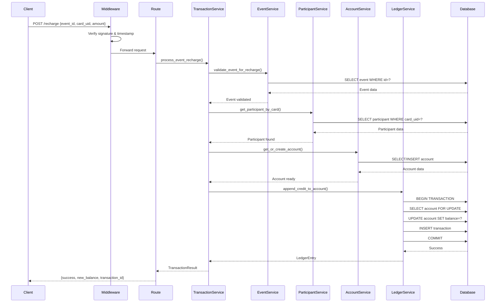
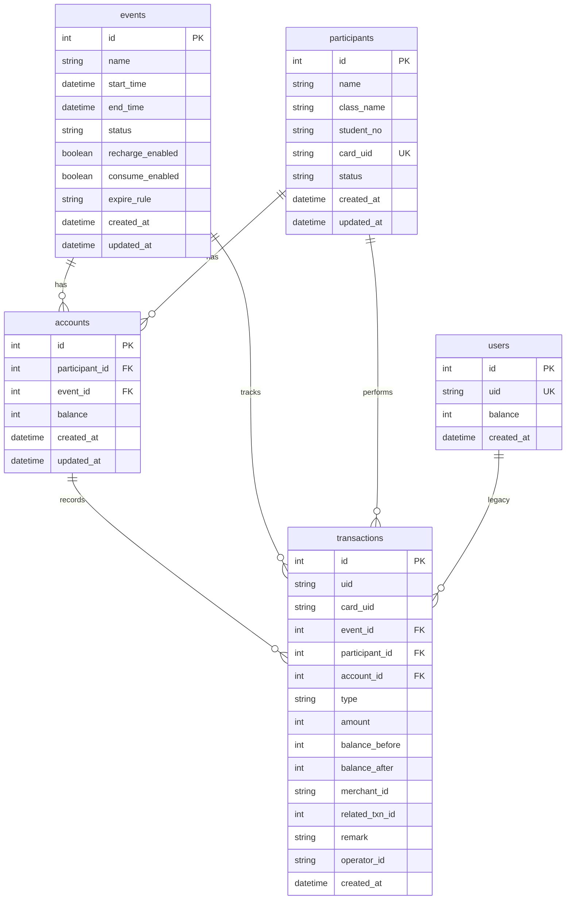

# Design Document: NFC Campus Event Quota System

## Overview

本设计文档描述了"学校单场活动额度系统"的技术架构和实现方案。该系统将基础 NFC 钱包升级为支持多活动隔离的额度管理系统。

### 核心特性

- **活动隔离**：每个活动拥有独立的额度系统，参与者在不同活动下有独立账户
- **卡片绑定**：NFC 卡仅存储 card_uid，所有余额和账户信息存储在服务器
- **活动控制**：活动管理员可以控制充值和消费的开关、时间范围
- **账本模式**：使用 Ledger Mode 保证交易一致性和可审计性
- **向后兼容**：保持原有 User 模型和接口的兼容性

### 设计目标

1. **数据隔离**：不同活动的额度完全隔离，互不影响
2. **并发安全**：使用行锁机制保证高并发场景下的数据一致性
3. **可审计性**：所有交易记录不可修改，支持完整的审计追踪
4. **可扩展性**：架构支持未来添加摊位、商品、排行榜等功能
5. **兼容性**：新旧接口共存，平滑迁移

## Architecture

### 系统架构图

```mermaid
graph TB
    subgraph "Client Layer"
        A[Android NFC Client]
        B[Admin Console]
    end
    
    subgraph "API Layer"
        C[FastAPI Routes]
        C1[/events]
        C2[/participants]
        C3[/recharge]
        C4[/payment]
        C5[/balance]
        C --> C1
        C --> C2
        C --> C3
        C --> C4
        C --> C5
    end
    
    subgraph "Middleware Layer"
        D[Signature Verification]
        E[Request Logging]
    end
    
    subgraph "Service Layer"
        F[EventService]
        G[ParticipantService]
        H[AccountService]
        I[LedgerService]
        J[TransactionService]
    end
    
    subgraph "Data Layer"
        K[(MySQL Database)]
        K1[events]
        K2[participants]
        K3[accounts]
        K4[transactions]
        K5[users - legacy]
        K --> K1
        K --> K2
        K --> K3
        K --> K4
        K --> K5
    end
    
    A --> D
    B --> D
    D --> E
    E --> C
    C --> F
    C --> G
    C --> J
    J --> I
    J --> H
    I --> K
    H --> K
    G --> K
    F --> K
```

### 架构分层说明

#### 1. Client Layer（客户端层）
- **Android NFC Client**：处理 NFC 卡片读取，发送充值/消费请求
- **Admin Console**：管理活动、参与者、查看统计数据

#### 2. API Layer（API 层）
- **Routes**：RESTful API 端点，处理 HTTP 请求和响应
- **Schema Validation**：使用 Pydantic 进行请求/响应验证

#### 3. Middleware Layer（中间件层）
- **Signature Verification**：验证请求签名和时间戳
- **Request Logging**：记录所有请求日志

#### 4. Service Layer（服务层）
- **EventService**：活动管理逻辑
- **ParticipantService**：参与者管理逻辑
- **AccountService**：账户管理逻辑
- **LedgerService**：账本追加模式核心逻辑
- **TransactionService**：交易处理协调逻辑

#### 5. Data Layer（数据层）
- **MySQL Database**：持久化存储
- **ORM Models**：SQLAlchemy 模型定义

### 数据流架构



## Components and Interfaces

### Service Layer Components

#### 1. EventService

**职责**：管理活动的生命周期和状态验证

**接口定义**：

```python
class EventService:
    def __init__(self, db_session: Session)
    
    def create_event(
        self,
        name: str,
        start_time: datetime,
        end_time: datetime,
        status: str = 'draft',
        recharge_enabled: bool = True,
        consume_enabled: bool = True,
        expire_rule: str = 'event_end'
    ) -> Event
    
    def get_event(self, event_id: int) -> Event
    
    def list_events(
        self,
        status: Optional[str] = None,
        limit: int = 100,
        offset: int = 0
    ) -> Dict[str, Any]
    
    def update_event(
        self,
        event_id: int,
        **kwargs
    ) -> Event
    
    def validate_event_for_recharge(self, event_id: int) -> Event
    
    def validate_event_for_consume(self, event_id: int) -> Event
```

**验证规则**：

- **充值验证**：
  - 活动状态必须为 `active`
  - 当前时间在活动时间范围内
  - `recharge_enabled` 标志为 `true`

- **消费验证**：
  - 活动状态必须为 `active`
  - 当前时间在活动时间范围内
  - `consume_enabled` 标志为 `true`

**异常**：
- `EventNotFoundError`：活动不存在
- `EventInactiveError`：活动未激活或不允许操作

#### 2. ParticipantService

**职责**：管理参与者信息和卡片绑定

**接口定义**：

```python
class ParticipantService:
    def __init__(self, db_session: Session)
    
    def create_participant(
        self,
        name: str,
        card_uid: str,
        class_name: Optional[str] = None,
        student_no: Optional[str] = None,
        status: str = 'active'
    ) -> Participant
    
    def get_participant(self, participant_id: int) -> Participant
    
    def get_participant_by_card(self, card_uid: str) -> Participant
    
    def list_participants(
        self,
        status: Optional[str] = None,
        limit: int = 100,
        offset: int = 0
    ) -> Dict[str, Any]
    
    def update_participant(
        self,
        participant_id: int,
        **kwargs
    ) -> Participant
    
    def bind_card(
        self,
        participant_id: int,
        card_uid: str
    ) -> Participant
```

**验证规则**：

- **card_uid 格式**：必须为十六进制字符串
- **card_uid 唯一性**：系统内全局唯一
- **参与者状态**：`active`、`inactive`、`blocked`

**异常**：
- `ParticipantNotFoundError`：参与者不存在
- `CardAlreadyBoundError`：卡片已被绑定
- `ParticipantBlockedError`：参与者已被封禁

#### 3. AccountService

**职责**：管理活动账户的创建和查询

**接口定义**：

```python
class AccountService:
    def __init__(self, db_session: Session)
    
    def get_or_create_account(
        self,
        participant_id: int,
        event_id: int
    ) -> Account
    
    def get_account(
        self,
        participant_id: int,
        event_id: int
    ) -> Optional[Account]
    
    def get_account_balance(
        self,
        participant_id: int,
        event_id: int
    ) -> int  # 返回余额（分）
    
    def list_participant_accounts(
        self,
        participant_id: int
    ) -> List[Account]
    
    def list_event_accounts(
        self,
        event_id: int,
        limit: int = 100,
        offset: int = 0
    ) -> Dict[str, Any]
```

**业务规则**：

- **账户唯一性**：一个参与者在一个活动下只能有一个账户
- **自动创建**：首次交易时自动创建账户，初始余额为 0
- **余额单位**：内部存储使用"分"，API 交互使用"元"
- **余额非负**：账户余额必须 >= 0

**异常**：
- `AccountNotFoundError`：账户不存在
- `DuplicateAccountError`：重复创建账户

#### 4. LedgerService（扩展）

**职责**：实现账本追加模式，支持 User 和 Account 两种模型

**新增接口**：

```python
class LedgerService:
    # 原有接口（User 模型）
    def append_credit(self, uid: str, amount_yuan: float, ...) -> LedgerEntry
    def append_debit(self, uid: str, amount_yuan: float, ...) -> LedgerEntry
    
    # 新增接口（Account 模型）
    def append_credit_to_account(
        self,
        account_id: int,
        amount_yuan: float,
        transaction_type: str = "recharge",
        event_id: Optional[int] = None,
        participant_id: Optional[int] = None,
        merchant_id: Optional[str] = None,
        related_txn_id: Optional[int] = None,
        remark: Optional[str] = None,
        operator_id: Optional[str] = None
    ) -> LedgerEntry
    
    def append_debit_from_account(
        self,
        account_id: int,
        amount_yuan: float,
        transaction_type: str = "pay",
        event_id: Optional[int] = None,
        participant_id: Optional[int] = None,
        merchant_id: Optional[str] = None,
        related_txn_id: Optional[int] = None,
        remark: Optional[str] = None,
        operator_id: Optional[str] = None
    ) -> LedgerEntry
    
    def _acquire_account_lock(self, account_id: int) -> Account
```

**实现要点**：

- **行锁机制**：使用 `SELECT ... FOR UPDATE` 锁定账户记录
- **事务边界**：每次操作在单个数据库事务内完成
- **余额验证**：借方操作前验证余额充足
- **记录完整性**：记录交易前后余额，确保可审计

**并发控制**：

```python
# Account 模式行锁
account = db.query(Account).filter(
    Account.id == account_id
).with_for_update().first()

# 事务内完成：
# 1. 验证余额（借方）
# 2. 更新账户余额
# 3. 创建交易记录
# 4. 提交事务
```

#### 5. TransactionService（扩展）

**职责**：协调交易处理流程，支持活动模式和传统模式

**新增接口**：

```python
class TransactionService:
    # 原有接口（uid 模式）
    def process_payment(self, uid: str, amount_yuan: float, ...) -> TransactionResult
    def process_recharge(self, uid: str, amount_yuan: float, ...) -> TransactionResult
    
    # 新增接口（活动模式）
    def process_event_payment(
        self,
        event_id: int,
        card_uid: str,
        amount_yuan: float,
        merchant_id: Optional[str] = None,
        remark: Optional[str] = None
    ) -> TransactionResult
    
    def process_event_recharge(
        self,
        event_id: int,
        card_uid: str,
        amount_yuan: float,
        operator_id: Optional[str] = None,
        remark: Optional[str] = None
    ) -> TransactionResult
    
    def get_event_transaction_history(
        self,
        event_id: int,
        participant_id: Optional[int] = None,
        start_date: Optional[str] = None,
        end_date: Optional[str] = None,
        limit: int = 100,
        offset: int = 0
    ) -> Dict[str, Any]
```

**处理流程**：

1. **活动模式充值**：
   ```
   validate_event_for_recharge()
   → get_participant_by_card()
   → get_or_create_account()
   → append_credit_to_account()
   → return TransactionResult
   ```

2. **活动模式消费**：
   ```
   validate_event_for_consume()
   → get_participant_by_card()
   → get_or_create_account()
   → append_debit_from_account()
   → return TransactionResult
   ```

### Route Layer Components

#### 1. Events Routes (`routes/events.py`)

**端点定义**：

```python
POST   /events              # 创建活动
GET    /events              # 活动列表
GET    /events/{id}         # 活动详情
PATCH  /events/{id}         # 更新活动
```

**请求/响应示例**：

```json
// POST /events
{
  "name": "2024春季校园美食节",
  "start_time": "2024-03-01T08:00:00Z",
  "end_time": "2024-03-03T20:00:00Z",
  "status": "draft",
  "recharge_enabled": true,
  "consume_enabled": true,
  "expire_rule": "event_end"
}

// Response
{
  "id": 1,
  "name": "2024春季校园美食节",
  "start_time": "2024-03-01T08:00:00Z",
  "end_time": "2024-03-03T20:00:00Z",
  "status": "draft",
  "recharge_enabled": true,
  "consume_enabled": true,
  "expire_rule": "event_end",
  "created_at": "2024-02-01T10:00:00Z",
  "updated_at": "2024-02-01T10:00:00Z"
}
```

#### 2. Participants Routes (`routes/participants.py`)

**端点定义**：

```python
POST   /participants                    # 创建参与者
GET    /participants                    # 参与者列表
GET    /participants/{id}               # 参与者详情
PATCH  /participants/{id}               # 更新参与者
POST   /participants/bind-card          # 绑定卡片
GET    /participants/by-card/{card_uid} # 通过卡片查询
```

**请求/响应示例**：

```json
// POST /participants
{
  "name": "张三",
  "class_name": "高一(1)班",
  "student_no": "2024001",
  "card_uid": "A1B2C3D4",
  "status": "active"
}

// Response
{
  "id": 1,
  "name": "张三",
  "class_name": "高一(1)班",
  "student_no": "2024001",
  "card_uid": "A1B2C3D4",
  "status": "active",
  "created_at": "2024-02-01T10:00:00Z",
  "updated_at": "2024-02-01T10:00:00Z"
}
```

#### 3. Recharge Route（扩展）

**端点定义**：

```python
POST   /recharge    # 充值（支持活动模式和传统模式）
```

**请求模式判断**：

```python
# 活动模式（新）
if request.event_id and request.card_uid:
    return transaction_service.process_event_recharge(
        event_id=request.event_id,
        card_uid=request.card_uid,
        amount_yuan=request.amount,
        ...
    )

# 传统模式（旧）
elif request.uid:
    return transaction_service.process_recharge(
        uid=request.uid,
        amount_yuan=request.amount,
        ...
    )
```

**请求/响应示例**：

```json
// 活动模式请求
{
  "event_id": 1,
  "card_uid": "A1B2C3D4",
  "amount": 50.00,
  "timestamp": 1234567890,
  "signature": "abc123...",
  "operator_id": "ADMIN001",
  "remark": "现金充值"
}

// 响应
{
  "success": true,
  "new_balance": 150.50,
  "transaction_id": 12346,
  "balance_before": 100.50
}
```

#### 4. Payment Route（扩展）

**端点定义**：

```python
POST   /pay    # 支付（支持活动模式和传统模式）
```

**请求模式判断**：同 Recharge Route

**请求/响应示例**：

```json
// 活动模式请求
{
  "event_id": 1,
  "card_uid": "A1B2C3D4",
  "amount": 25.00,
  "timestamp": 1234567890,
  "signature": "abc123...",
  "merchant_id": "MERCHANT001",
  "remark": "购买商品"
}

// 响应
{
  "success": true,
  "new_balance": 125.50,
  "transaction_id": 12347,
  "balance_before": 150.50
}
```

#### 5. Balance Route（扩展）

**端点定义**：

```python
GET    /balance    # 余额查询（支持活动模式和传统模式）
```

**查询参数**：

```python
# 活动模式（新）
GET /balance?event_id=1&card_uid=A1B2C3D4&timestamp=...&signature=...

# 传统模式（旧）
GET /balance?uid=A1B2C3D4&timestamp=...&signature=...
```

**响应示例**：

```json
{
  "balance": 125.50
}
```

## Data Models

### Entity Relationship Diagram



### Model Specifications

#### 1. Event Model

**表名**：`events`

**字段定义**：

| 字段 | 类型 | 约束 | 说明 |
|------|------|------|------|
| id | INT | PK, AUTO_INCREMENT | 活动ID |
| name | VARCHAR(255) | NOT NULL | 活动名称 |
| start_time | DATETIME | NOT NULL | 开始时间 |
| end_time | DATETIME | NOT NULL | 结束时间 |
| status | VARCHAR(20) | NOT NULL, DEFAULT 'draft' | 状态：draft/active/paused/ended |
| recharge_enabled | BOOLEAN | NOT NULL, DEFAULT TRUE | 是否允许充值 |
| consume_enabled | BOOLEAN | NOT NULL, DEFAULT TRUE | 是否允许消费 |
| expire_rule | VARCHAR(50) | DEFAULT 'event_end' | 过期规则：event_end/never/custom |
| created_at | DATETIME | NOT NULL | 创建时间 |
| updated_at | DATETIME | NOT NULL | 更新时间 |

**约束**：
- `CHECK (status IN ('draft', 'active', 'paused', 'ended'))`
- `CHECK (end_time > start_time)`
- `CHECK (expire_rule IN ('event_end', 'never', 'custom'))`

**索引**：
- `idx_status (status)`
- `idx_start_time (start_time)`
- `idx_end_time (end_time)`

#### 2. Participant Model

**表名**：`participants`

**字段定义**：

| 字段 | 类型 | 约束 | 说明 |
|------|------|------|------|
| id | INT | PK, AUTO_INCREMENT | 参与者ID |
| name | VARCHAR(100) | NOT NULL | 姓名 |
| class_name | VARCHAR(100) | NULL | 班级 |
| student_no | VARCHAR(50) | NULL | 学号 |
| card_uid | VARCHAR(32) | UNIQUE, NOT NULL | NFC卡片UID |
| status | VARCHAR(20) | NOT NULL, DEFAULT 'active' | 状态：active/inactive/blocked |
| created_at | DATETIME | NOT NULL | 创建时间 |
| updated_at | DATETIME | NOT NULL | 更新时间 |

**约束**：
- `CHECK (status IN ('active', 'inactive', 'blocked'))`
- `UNIQUE (card_uid)`

**索引**：
- `idx_card_uid (card_uid)`
- `idx_student_no (student_no)`
- `idx_status (status)`
- `idx_name (name)`

#### 3. Account Model

**表名**：`accounts`

**字段定义**：

| 字段 | 类型 | 约束 | 说明 |
|------|------|------|------|
| id | INT | PK, AUTO_INCREMENT | 账户ID |
| participant_id | INT | FK, NOT NULL | 参与者ID |
| event_id | INT | FK, NOT NULL | 活动ID |
| balance | INT | NOT NULL, DEFAULT 0 | 余额（分） |
| created_at | DATETIME | NOT NULL | 创建时间 |
| updated_at | DATETIME | NOT NULL | 更新时间 |

**约束**：
- `FOREIGN KEY (participant_id) REFERENCES participants(id) ON DELETE CASCADE`
- `FOREIGN KEY (event_id) REFERENCES events(id) ON DELETE CASCADE`
- `UNIQUE (participant_id, event_id)`
- `CHECK (balance >= 0)`

**索引**：
- `idx_participant_id (participant_id)`
- `idx_event_id (event_id)`
- `idx_balance (balance)`
- `idx_participant_event (participant_id, event_id)` - 复合索引

#### 4. Transaction Model（扩展）

**表名**：`transactions`

**新增字段**：

| 字段 | 类型 | 约束 | 说明 |
|------|------|------|------|
| event_id | INT | FK, NULL | 活动ID（活动模式） |
| participant_id | INT | FK, NULL | 参与者ID（活动模式） |
| account_id | INT | FK, NULL | 账户ID（活动模式） |

**约束**：
- `FOREIGN KEY (event_id) REFERENCES events(id) ON DELETE SET NULL`
- `FOREIGN KEY (participant_id) REFERENCES participants(id) ON DELETE SET NULL`
- `FOREIGN KEY (account_id) REFERENCES accounts(id) ON DELETE SET NULL`

**索引**：
- `idx_event_id (event_id)`
- `idx_participant_id (participant_id)`
- `idx_account_id (account_id)`
- `idx_event_participant (event_id, participant_id)` - 复合索引
- `idx_account_created (account_id, created_at)` - 复合索引

### Data Model Relationships

1. **Event → Account**：一对多关系
   - 一个活动可以有多个账户
   - 级联删除：删除活动时删除所有相关账户

2. **Participant → Account**：一对多关系
   - 一个参与者可以在多个活动下有账户
   - 级联删除：删除参与者时删除所有相关账户

3. **Account → Transaction**：一对多关系
   - 一个账户可以有多条交易记录
   - 设置为 NULL：删除账户时交易记录保留但 account_id 设为 NULL

4. **Event → Transaction**：一对多关系
   - 一个活动可以有多条交易记录
   - 设置为 NULL：删除活动时交易记录保留但 event_id 设为 NULL

5. **Participant → Transaction**：一对多关系
   - 一个参与者可以有多条交易记录
   - 设置为 NULL：删除参与者时交易记录保留但 participant_id 设为 NULL

### Data Integrity Rules

1. **账户唯一性**：`UNIQUE (participant_id, event_id)`
   - 确保一个参与者在一个活动下只有一个账户

2. **余额非负**：`CHECK (balance >= 0)`
   - 确保账户余额不会为负数

3. **活动时间有效性**：`CHECK (end_time > start_time)`
   - 确保活动结束时间晚于开始时间

4. **状态枚举**：使用 CHECK 约束限制状态值
   - Event status: draft, active, paused, ended
   - Participant status: active, inactive, blocked

5. **卡片唯一性**：`UNIQUE (card_uid)`
   - 确保每张 NFC 卡只能绑定一个参与者


## Correctness Properties

*A property is a characteristic or behavior that should hold true across all valid executions of a system—essentially, a formal statement about what the system should do. Properties serve as the bridge between human-readable specifications and machine-verifiable correctness guarantees.*

### Property-Based Testing Applicability

本系统**部分适合**使用 Property-Based Testing (PBT)。核心的账本逻辑、交易处理和输入验证适合使用 PBT，但简单的 CRUD 操作应该使用 example-based tests。

**适合 PBT 的部分**：
- 账本模式的交易处理（round-trip properties, invariants）
- 金额单位转换（元 ↔ 分）
- 输入验证（card_uid 格式、金额正数、时间范围等）
- 账户余额不变量
- 交易记录完整性

**不适合 PBT 的部分**：
- 简单的 CRUD 操作（创建活动、查询参与者等）
- 配置验证（枚举值检查）
- 基础设施集成（数据库事务、并发控制）

### Property Reflection

在编写具体属性之前，我们需要识别并消除冗余的属性：

**识别的冗余**：
1. 活动验证属性（2.1-2.6）可以合并为两个综合属性：充值验证和消费验证
2. 金额转换属性（14.4, 14.5）可以合并为一个 round-trip 属性
3. 输入验证属性（15.1-15.3）已在其他需求中覆盖，无需重复
4. 账户余额非负（4.7）和余额验证（8.3）可以合并为一个不变量属性

**最终属性列表**：
- Property 1: 活动时间验证
- Property 2: 活动充值验证
- Property 3: 活动消费验证
- Property 4: Card UID 格式验证
- Property 5: Card UID 唯一性
- Property 6: 账户唯一性
- Property 7: 账户余额非负不变量
- Property 8: 金额单位转换 round-trip
- Property 9: 交易余额计算正确性
- Property 10: 充值金额验证
- Property 11: 字符串长度验证
- Property 12: 交易响应完整性

### Property 1: 活动时间验证

*For any* event with start_time and end_time, the system SHALL reject creation or update if end_time <= start_time

**Validates: Requirements 1.2, 15.3**

**Rationale**: 活动的结束时间必须晚于开始时间，这是一个基本的时间逻辑约束。通过生成随机的时间对，我们可以验证系统正确地拒绝无效的时间范围。

### Property 2: 活动充值验证

*For any* event and current time, the system SHALL allow recharge if and only if:
- event.status == 'active' AND
- start_time <= current_time <= end_time AND
- event.recharge_enabled == true

**Validates: Requirements 2.1, 2.2, 2.3**

**Rationale**: 充值操作的允许条件是三个条件的逻辑与。通过生成随机的活动状态、时间和标志组合，我们可以验证验证逻辑的正确性。

### Property 3: 活动消费验证

*For any* event and current time, the system SHALL allow consumption if and only if:
- event.status == 'active' AND
- start_time <= current_time <= end_time AND
- event.consume_enabled == true

**Validates: Requirements 2.4, 2.5, 2.6**

**Rationale**: 消费操作的允许条件与充值类似，但检查 consume_enabled 标志。这是一个独立的验证逻辑，需要单独测试。

### Property 4: Card UID 格式验证

*For any* string input, the system SHALL accept it as a valid card_uid if and only if it contains only hexadecimal characters (0-9, A-F, a-f)

**Validates: Requirements 3.2, 15.1**

**Rationale**: Card UID 必须是十六进制格式。通过生成随机字符串（包括有效和无效的十六进制字符串），我们可以验证格式验证逻辑的正确性。

### Property 5: Card UID 唯一性

*For any* two participants, if they have the same card_uid, the system SHALL reject the creation of the second participant

**Validates: Requirements 3.3**

**Rationale**: Card UID 在系统中必须唯一。通过尝试创建具有相同 card_uid 的参与者，我们可以验证唯一性约束的执行。

### Property 6: 账户唯一性

*For any* participant and event combination, the system SHALL ensure only one account exists for that (participant_id, event_id) pair

**Validates: Requirements 4.2**

**Rationale**: 一个参与者在一个活动下只能有一个账户。通过尝试为同一参与者和活动创建多个账户，我们可以验证唯一性约束。

### Property 7: 账户余额非负不变量

*For any* account at any point in time, the account balance SHALL be >= 0, and any operation that would result in negative balance SHALL be rejected

**Validates: Requirements 4.7, 8.3**

**Rationale**: 账户余额不能为负数是一个关键的不变量。通过生成随机的借方操作（包括会导致余额为负的操作），我们可以验证系统正确地拒绝无效操作。

### Property 8: 金额单位转换 round-trip

*For any* amount in yuan (with at most 2 decimal places), converting to cents and back to yuan SHALL preserve the original value

**Validates: Requirements 4.5, 14.4, 14.5, 14.6**

**Rationale**: 金额在元和分之间的转换必须保持精度。通过生成随机的金额值并执行 round-trip 转换（yuan → cents → yuan），我们可以验证转换逻辑的正确性。

**Note**: 由于浮点数精度限制，我们允许 0.01 元的误差范围。

### Property 9: 交易余额计算正确性

*For any* transaction (credit or debit), the system SHALL ensure:
- For credit: balance_after = balance_before + amount
- For debit: balance_after = balance_before - amount

**Validates: Requirements 8.7**

**Rationale**: 这是账本模式的核心不变量。每笔交易的余额计算必须正确。通过生成随机的交易（贷方和借方），我们可以验证余额计算逻辑。

### Property 10: 充值金额验证

*For any* recharge or payment amount, the system SHALL accept it if and only if amount > 0

**Validates: Requirements 5.8, 15.2**

**Rationale**: 交易金额必须为正数。通过生成随机的金额值（包括正数、零和负数），我们可以验证金额验证逻辑。

### Property 11: 字符串长度验证

*For any* string field with a maximum length constraint, the system SHALL reject inputs exceeding that length

**Validates: Requirements 15.6**

**Rationale**: 所有字符串字段都有长度限制。通过生成不同长度的随机字符串，我们可以验证长度验证逻辑对所有字段都正确工作。

### Property 12: 交易响应完整性

*For any* successful transaction (recharge or payment), the response SHALL contain:
- success: true
- new_balance: float
- transaction_id: int
- balance_before: float

**Validates: Requirements 5.5**

**Rationale**: 交易响应必须包含所有必需的字段。通过执行随机的交易操作，我们可以验证响应格式的一致性。

## Error Handling

### Error Categories

系统定义了以下错误类别，每个类别对应特定的业务场景：

#### 1. Business Logic Errors

**EventNotFoundError**
- **Error Code**: `EVENT_NOT_FOUND`
- **HTTP Status**: 400
- **Trigger**: 查询或操作不存在的活动
- **Message Format**: `"Event with ID '{event_id}' does not exist"`

**EventInactiveError**
- **Error Code**: `EVENT_INACTIVE`
- **HTTP Status**: 400
- **Trigger**: 尝试在非活跃状态的活动中进行交易
- **Message Format**: `"Event '{event_id}' is not active: {reason}"`
- **Reasons**: 
  - `"status is '{status}'"`
  - `"not within time range"`
  - `"recharge is disabled"`
  - `"consumption is disabled"`

**ParticipantNotFoundError**
- **Error Code**: `PARTICIPANT_NOT_FOUND`
- **HTTP Status**: 400
- **Trigger**: 查询或操作不存在的参与者
- **Message Format**: `"Participant with ID/card_uid '{identifier}' does not exist"`

**ParticipantBlockedError**
- **Error Code**: `PARTICIPANT_BLOCKED`
- **HTTP Status**: 403
- **Trigger**: 被封禁的参与者尝试进行交易
- **Message Format**: `"Participant '{participant_id}' is blocked"`

**AccountNotFoundError**
- **Error Code**: `ACCOUNT_NOT_FOUND`
- **HTTP Status**: 400
- **Trigger**: 查询不存在的账户
- **Message Format**: `"Account not found for participant '{participant_id}' in event '{event_id}'"`

**InsufficientFundsError**
- **Error Code**: `INSUFFICIENT_FUNDS`
- **HTTP Status**: 400
- **Trigger**: 账户余额不足以完成支付
- **Message Format**: `"Account balance ({balance} yuan) is insufficient for transaction amount ({amount} yuan)"`

**CardAlreadyBoundError**
- **Error Code**: `CARD_ALREADY_BOUND`
- **HTTP Status**: 400
- **Trigger**: 尝试绑定已被使用的 card_uid
- **Message Format**: `"Card UID '{card_uid}' is already bound to another participant"`

#### 2. Validation Errors

**ValidationError**
- **Error Code**: `VALIDATION_ERROR`
- **HTTP Status**: 400
- **Trigger**: 输入数据验证失败
- **Message Format**: 具体的验证错误信息
- **Examples**:
  - `"card_uid must be a hexadecimal string"`
  - `"Amount must be positive"`
  - `"end_time must be after start_time"`
  - `"Amount exceeds maximum transaction limit"`
  - `"Field '{field}' exceeds maximum length of {max_length}"`

#### 3. Authentication Errors

**SignatureVerificationError**
- **Error Code**: `SIGNATURE_VERIFICATION_FAILED`
- **HTTP Status**: 401
- **Trigger**: 请求签名验证失败
- **Message Format**: `"Request signature verification failed"`

**TimestampExpiredError**
- **Error Code**: `TIMESTAMP_EXPIRED`
- **HTTP Status**: 401
- **Trigger**: 请求时间戳过期
- **Message Format**: `"Request timestamp has expired"`

#### 4. System Errors

**InternalError**
- **Error Code**: `INTERNAL_ERROR`
- **HTTP Status**: 500
- **Trigger**: 未预期的系统错误
- **Message Format**: `"An internal error occurred. Please try again later."`
- **Note**: 详细错误信息记录在日志中，不暴露给客户端

**DatabaseError**
- **Error Code**: `DATABASE_ERROR`
- **HTTP Status**: 500
- **Trigger**: 数据库操作失败
- **Message Format**: `"Database operation failed"`

### Error Response Format

所有错误响应遵循统一的 JSON 格式：

```json
{
  "error_code": "ERROR_CODE",
  "message": "Human-readable error message",
  "field": "field_name",  // Optional: for validation errors
  "value": "invalid_value"  // Optional: for validation errors
}
```

### Error Handling Strategy

#### 1. Service Layer

服务层抛出具体的业务异常：

```python
# Example: EventService
def validate_event_for_recharge(self, event_id: int) -> Event:
    event = self.get_event(event_id)
    
    if not event.can_recharge():
        if event.status != 'active':
            raise EventInactiveError(event_id, f"status is '{event.status}'")
        elif not event.is_within_time_range():
            raise EventInactiveError(event_id, "not within time range")
        elif not event.recharge_enabled:
            raise EventInactiveError(event_id, "recharge is disabled")
    
    return event
```

#### 2. Route Layer

路由层捕获异常并转换为 HTTP 响应：

```python
# Example: Recharge endpoint
try:
    result = transaction_service.process_event_recharge(...)
    return TransactionResponse(...)
except ParticipantNotFoundError as e:
    return JSONResponse(
        status_code=400,
        content={
            "error_code": e.error_code,
            "message": e.message
        }
    )
except EventInactiveError as e:
    return JSONResponse(
        status_code=400,
        content={
            "error_code": e.error_code,
            "message": e.message
        }
    )
except Exception as e:
    logger.error(f"Unexpected error: {str(e)}", exc_info=True)
    return JSONResponse(
        status_code=500,
        content={
            "error_code": "INTERNAL_ERROR",
            "message": "An internal error occurred. Please try again later."
        }
    )
```

#### 3. Transaction Rollback

所有数据库操作在事务内执行，错误时自动回滚：

```python
# Example: LedgerService
try:
    # 1. Acquire lock
    account = self._acquire_account_lock(account_id)
    
    # 2. Validate balance
    if account.balance < amount_cents:
        raise InsufficientFundsError(...)
    
    # 3. Update balance
    account.balance -= amount_cents
    
    # 4. Create transaction record
    transaction = self._create_ledger_entry(...)
    
    # 5. Commit
    self.db.commit()
    
except Exception as e:
    # Rollback on any error
    self.db.rollback()
    raise
```

### Logging Strategy

#### 1. Log Levels

- **INFO**: 正常业务操作（交易成功、查询成功等）
- **WARNING**: 业务异常（余额不足、参与者不存在等）
- **ERROR**: 系统错误（数据库错误、未预期异常等）

#### 2. Log Format

使用结构化日志格式：

```python
logger.info(
    f"Recharge successful: event_id={event_id}, card_uid={card_uid}, "
    f"amount={amount} yuan, txn_id={transaction_id}, "
    f"balance: {balance_before} -> {balance_after} yuan"
)

logger.warning(
    f"Recharge failed: event_id={event_id}, card_uid={card_uid}, "
    f"error={error_code}, message={error_message}"
)

logger.error(
    f"Unexpected error in recharge: event_id={event_id}, "
    f"card_uid={card_uid}, error={str(e)}",
    exc_info=True
)
```

#### 3. Log Content

**成功交易日志**：
- 操作类型（recharge/payment）
- 活动 ID 和参与者标识
- 交易金额
- 交易前后余额
- 交易 ID

**失败操作日志**：
- 操作类型
- 失败原因（错误码和消息）
- 相关标识符（event_id, card_uid 等）

**系统错误日志**：
- 完整的错误堆栈信息
- 请求上下文
- 相关数据状态

## Testing Strategy

### Testing Approach

本系统采用**双重测试策略**，结合 example-based tests 和 property-based tests：

1. **Example-Based Unit Tests**：
   - 测试具体的业务场景和边界情况
   - 测试 CRUD 操作
   - 测试错误处理
   - 测试 API 端点

2. **Property-Based Tests**：
   - 测试通用属性和不变量
   - 测试输入验证逻辑
   - 测试账本模式的正确性
   - 测试金额转换逻辑

3. **Integration Tests**：
   - 测试完整的交易流程
   - 测试并发安全性
   - 测试数据库事务
   - 测试服务间集成

### Property-Based Testing Configuration

**测试库选择**：Python 的 `hypothesis` 库

**配置要求**：
- 每个 property test 最少运行 **100 次迭代**
- 使用 `@given` 装饰器定义输入生成器
- 使用 `@settings(max_examples=100)` 配置迭代次数

**标签格式**：
每个 property test 必须包含注释，引用设计文档中的属性：

```python
@given(
    start_time=datetimes(),
    end_time=datetimes()
)
@settings(max_examples=100)
def test_event_time_validation(start_time, end_time):
    """
    Feature: nfc-campus-wallet, Property 1: 活动时间验证
    
    For any event with start_time and end_time, the system SHALL reject 
    creation or update if end_time <= start_time
    """
    # Test implementation
```

### Test Coverage by Component

#### 1. EventService Tests

**Example-Based Tests**：
- `test_create_event_success()` - 创建活动成功
- `test_create_event_with_invalid_status()` - 无效状态被拒绝
- `test_get_event_not_found()` - 查询不存在的活动
- `test_list_events_with_filter()` - 按状态过滤活动列表
- `test_update_event_partial()` - 部分更新活动

**Property-Based Tests**：
- `test_event_time_validation_property()` - Property 1: 活动时间验证
- `test_event_recharge_validation_property()` - Property 2: 活动充值验证
- `test_event_consume_validation_property()` - Property 3: 活动消费验证

#### 2. ParticipantService Tests

**Example-Based Tests**：
- `test_create_participant_success()` - 创建参与者成功
- `test_get_participant_by_card()` - 通过 card_uid 查询
- `test_bind_card_success()` - 绑定卡片成功
- `test_list_participants_with_pagination()` - 分页查询

**Property-Based Tests**：
- `test_card_uid_format_validation_property()` - Property 4: Card UID 格式验证
- `test_card_uid_uniqueness_property()` - Property 5: Card UID 唯一性

#### 3. AccountService Tests

**Example-Based Tests**：
- `test_get_or_create_account_creates_new()` - 自动创建账户
- `test_get_or_create_account_returns_existing()` - 返回已存在账户
- `test_get_account_balance()` - 查询余额
- `test_list_participant_accounts()` - 查询参与者所有账户

**Property-Based Tests**：
- `test_account_uniqueness_property()` - Property 6: 账户唯一性
- `test_account_balance_non_negative_property()` - Property 7: 账户余额非负不变量
- `test_amount_unit_conversion_roundtrip_property()` - Property 8: 金额单位转换 round-trip

#### 4. LedgerService Tests

**Example-Based Tests**：
- `test_append_credit_to_account_success()` - 贷方记录成功
- `test_append_debit_from_account_success()` - 借方记录成功
- `test_append_debit_insufficient_funds()` - 余额不足被拒绝
- `test_transaction_rollback_on_error()` - 错误时回滚

**Property-Based Tests**：
- `test_transaction_balance_calculation_property()` - Property 9: 交易余额计算正确性
- `test_account_balance_non_negative_invariant()` - Property 7: 余额非负不变量（与 AccountService 共享）

**Integration Tests**：
- `test_concurrent_transactions_on_same_account()` - 并发交易安全性
- `test_transaction_atomicity()` - 事务原子性

#### 5. TransactionService Tests

**Example-Based Tests**：
- `test_process_event_recharge_success()` - 活动模式充值成功
- `test_process_event_payment_success()` - 活动模式消费成功
- `test_process_event_recharge_participant_not_found()` - 参与者不存在
- `test_process_event_payment_insufficient_funds()` - 余额不足
- `test_get_event_transaction_history()` - 查询交易历史

**Property-Based Tests**：
- `test_recharge_amount_validation_property()` - Property 10: 充值金额验证
- `test_transaction_response_completeness_property()` - Property 12: 交易响应完整性

**Integration Tests**：
- `test_full_recharge_flow()` - 完整充值流程
- `test_full_payment_flow()` - 完整消费流程

#### 6. Route Layer Tests

**Example-Based Tests**：
- `test_post_events_endpoint()` - POST /events
- `test_get_events_endpoint()` - GET /events
- `test_post_participants_endpoint()` - POST /participants
- `test_post_recharge_event_mode()` - POST /recharge (活动模式)
- `test_post_recharge_legacy_mode()` - POST /recharge (传统模式)
- `test_post_payment_event_mode()` - POST /pay (活动模式)
- `test_get_balance_event_mode()` - GET /balance (活动模式)

**Property-Based Tests**：
- `test_string_length_validation_property()` - Property 11: 字符串长度验证

**Integration Tests**：
- `test_signature_verification_middleware()` - 签名验证中间件
- `test_request_logging_middleware()` - 请求日志中间件

### Test Data Generation

#### Hypothesis Strategies

```python
from hypothesis import strategies as st
from datetime import datetime, timedelta

# Event data
events = st.builds(
    dict,
    name=st.text(min_size=1, max_size=255),
    start_time=st.datetimes(
        min_value=datetime(2024, 1, 1),
        max_value=datetime(2025, 12, 31)
    ),
    end_time=st.datetimes(
        min_value=datetime(2024, 1, 1),
        max_value=datetime(2025, 12, 31)
    ),
    status=st.sampled_from(['draft', 'active', 'paused', 'ended']),
    recharge_enabled=st.booleans(),
    consume_enabled=st.booleans()
)

# Card UID (hexadecimal)
card_uids = st.text(
    alphabet='0123456789ABCDEF',
    min_size=8,
    max_size=32
)

# Amounts in yuan (2 decimal places)
yuan_amounts = st.floats(
    min_value=0.01,
    max_value=10000.00,
    allow_nan=False,
    allow_infinity=False
).map(lambda x: round(x, 2))

# Amounts in cents
cent_amounts = st.integers(min_value=1, max_value=1000000)
```

### Continuous Integration

**测试执行顺序**：
1. Unit tests (example-based)
2. Property-based tests
3. Integration tests

**覆盖率目标**：
- 代码覆盖率：>= 80%
- 分支覆盖率：>= 75%
- Property tests 迭代次数：>= 100

**CI 配置**：
```yaml
# .github/workflows/test.yml
test:
  runs-on: ubuntu-latest
  steps:
    - name: Run unit tests
      run: pytest tests/unit -v
    
    - name: Run property tests
      run: pytest tests/property -v --hypothesis-show-statistics
    
    - name: Run integration tests
      run: pytest tests/integration -v
    
    - name: Generate coverage report
      run: pytest --cov=. --cov-report=html
```

### Test Maintenance

**测试更新策略**：
1. 需求变更时，首先更新对应的 property test
2. 添加新功能时，同时添加 example-based test 和 property test（如适用）
3. 发现 bug 时，先写失败的测试，再修复代码
4. 定期审查测试覆盖率，补充缺失的测试

**Property Test 调试**：
- 使用 `@example()` 装饰器添加已知的失败案例
- 使用 `hypothesis.note()` 记录中间状态
- 使用 `--hypothesis-seed` 重现失败的测试

